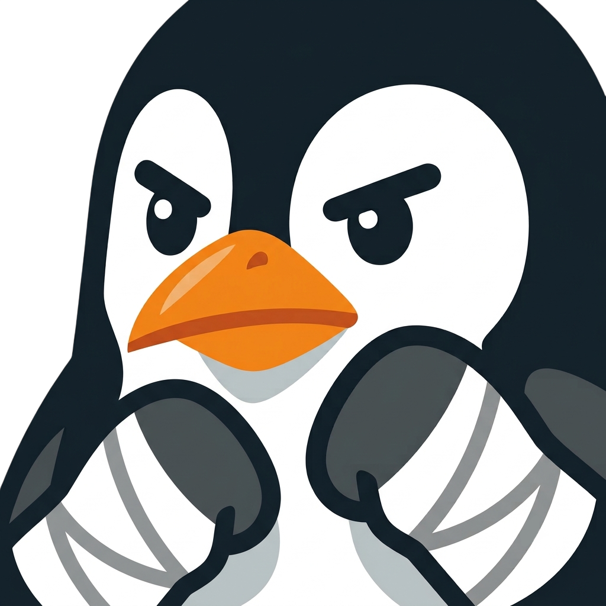

<h1>Super Smash Tux</h1>

Videojuego de peleas inspirado en Super Smash Bros, con los personajes más famosos del software libre. Hecho en Godot 4 usando GDScript.

## Características de juego

- Combate multijugador local (teclado con controles independientes para 2 jugadores).

## Requisitos

- [Godot Engine 4+](https://godotengine.org/download)

## Cómo abrir el proyecto

1. Clona el repositorio.
2. Abre Godot 4+ y selecciona "Importar", apuntando al directorio raíz del proyecto.
3. Corre la escena principal (`scenes/main.tscn`) desde el editor.

Para más detalles sobre la estructura de carpetas y convenciones del proyecto, revisa [docs/estructura.md](./docs/estructura.md).

## Licencia

Este proyecto está bajo la licencia [GPL-3.0](./LICENSE).

## Contribuir

El proyecto es open source y las contribuciones son bienvenidas. Asegurate de seguir las directrices descritas en [AGENTS.md](./AGENTS.md) si vas a usar un agente de IA para contribuir.
