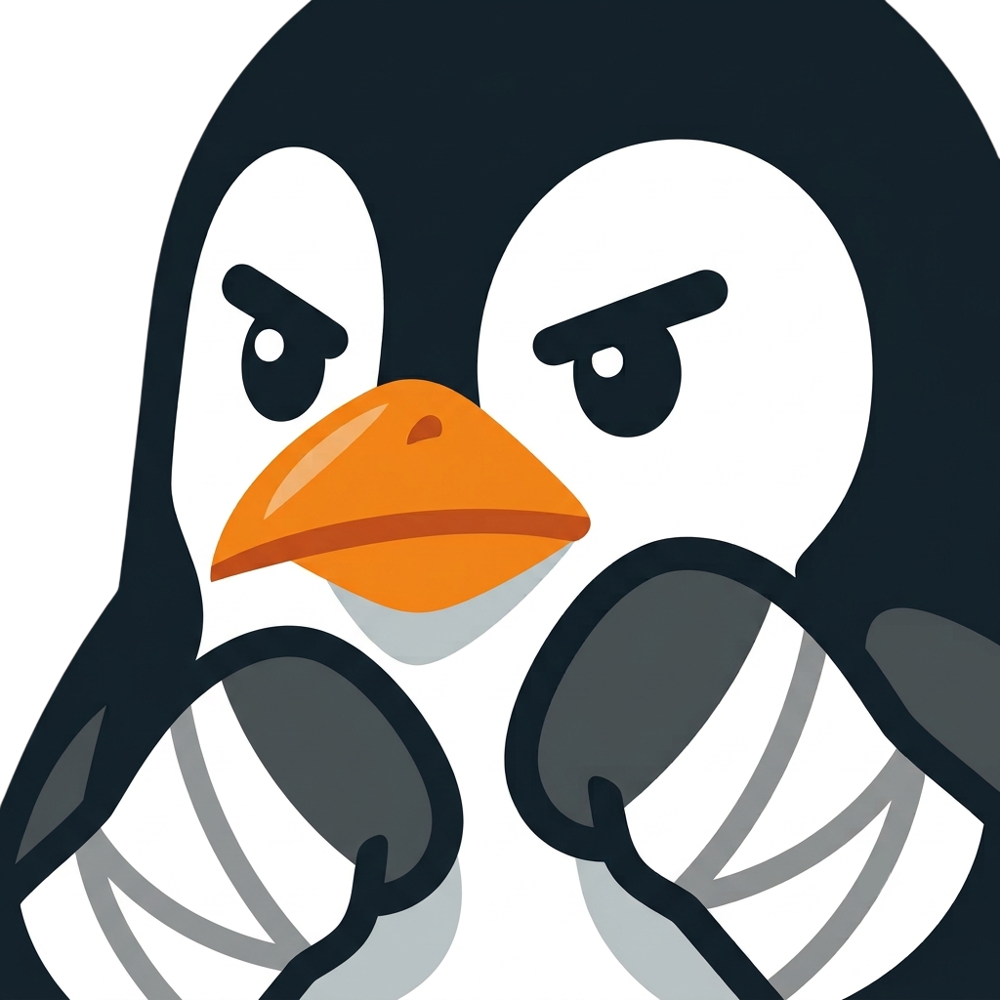

  

<h1 align="center">Super Smash Tux</h1>

Videojuego de peleas inspirado en Super Smash Bros, con los personajes más famosos del software libre. Hecho en Godot 4 usando GDScript.

## Características de juego

- Combate multijugador local para 2 jugadores.
- Soporte para teclado y gamepad.

## Requisitos

- [Godot Engine 4+](https://godotengine.org/download) (4.7+ si se quiere usar MCP para agentes de IA)
- [uv](https://docs.astral.sh/uv/) (opcional si se quiere usar MCP para agentes de IA)
- [Python 3.12+](https://www.python.org/downloads/) (opcional si se quiere usar MCP para agentes de IA)
- [Blender 5.1+](https://www.blender.org/download/) (opcional si se quiere editar los modelos 3D)

## Cómo abrir el proyecto

1. Clona el repositorio.
2. Abre Godot 4+ y selecciona "Importar", apuntando al directorio raíz del proyecto.
3. Corre la escena principal (`scenes/main.tscn`) desde el editor.

Si vas a trabajar con un agente de IA, conéctalo antes de arrancarlo: el MCP de Godot desde el panel **Godot AI** del editor y el de Blender con `mcp-setup.bat` (ver [Desarrollo con IA](#desarrollo-con-ia)).

Para más detalles sobre la estructura de carpetas y convenciones del proyecto, revisa [docs/estructura.md](./docs/estructura.md).

## Desarrollo con IA

El proyecto se conecta con agentes de IA (Claude Code, OpenCode y Codex) mediante dos servidores MCP, para que puedan trabajar por su cuenta:

| Servidor | Qué permite | Cómo se configura | Requisitos |
|---|---|---|---|
| `godot-ai` | Controlar el editor de Godot abierto (escenas, nodos, scripts, señales, UI, animación), correr el juego y leer sus errores, vía [Godot AI](https://github.com/hi-godot/godot-ai) | Botón **Configure** en el panel **Godot AI** del editor | [Godot 4.7+](https://godotengine.org/download) y [uv](https://docs.astral.sh/uv/) |
| `blender` | Inspeccionar y editar la escena abierta en Blender, vía [MCP oficial de Blender Lab](https://www.blender.org/lab/mcp-server/) | `mcp-setup.bat` (o `mcp-setup.sh` en Linux) | [Blender 5.1+](https://www.blender.org/download/) y [uv](https://docs.astral.sh/uv/) |

Después de configurar cualquiera de los dos hay que reiniciar el agente de código para que tome la configuración nueva.

### Sobre el MCP de Godot (Godot AI)

Son **dos piezas** que se comunican por conexiones locales autenticadas (puertos `8000` y `9500`):

- el **plugin** en `addons/godot_ai/`, que viene incluido en el repositorio y ya está activado en `project.godot`;
- el servidor **`godot-ai`** (Python), que se descarga y se lanza con `uvx` la primera vez que se usa.

Para conectarlo:

1. Abre el proyecto en Godot 4.7+. Aparece el panel **Godot AI**.
2. En ese panel, pulsa **Configure** junto a tu agente (Claude Code, Codex, OpenCode, etc.). La configuración se guarda en tu usuario, no en el repositorio.
3. Reinicia el agente.

A tener en cuenta:

- **El editor tiene que estar abierto:** el agente trabaja sobre el editor en vivo, así que sin Godot abierto no puede conectarse.
- **Telemetría:** Godot AI envía estadísticas de uso anónimas por defecto. Para apagarla, en el panel **Godot AI** abre **Clients & Settings → Settings**, desmarca **Telemetry**, pulsa **Apply & Restart Server** y vuelve a pulsar **Configure** en cada agente. También se puede con la variable de entorno `GODOT_AI_DISABLE_TELEMETRY=true`. Es una preferencia de cada persona: se guarda en la configuración del editor, no en el proyecto.
- **Autoload `_mcp_game_helper`:** el plugin lo agrega a `project.godot` para inspeccionar el juego mientras corre. En los builds exportados queda inactivo. Si algún día se quita el plugin, hay que quitar también este autoload.
- **Actualizaciones:** cuando hay una versión nueva, el panel muestra el botón **Update**. No copies una versión nueva encima de la carpeta a mano.
- **Un agente a la vez:** si dos agentes controlan el mismo editor al mismo tiempo, se pisan los cambios.

### Sobre el MCP de Blender

El MCP oficial de Blender son **dos piezas** que se comunican por un socket TCP en `localhost:9876`:

- un **add-on** que corre dentro de Blender y ejecuta los pedidos;
- el servidor **`blender-mcp`**, que lanza el agente de código.

Se configura con **mcp-setup.bat**, que hay que ejecutar antes de usar el MCP por primera vez. Al abrirlo aparece un menú para elegir qué agentes configurar. El script detecta Blender por su cuenta y escribe `BLENDER_PATH` en el archivo de cada agente (`.mcp.json`, `opencode.json` o `.codex/config.toml`).

`mcp-setup.bat` se encarga de las dos piezas: instala `uv` con winget, agrega el repositorio de extensiones `https://lab.blender.org/` y desde ahí instala y habilita el add-on. Instalarlo desde el repositorio permite recibir actualizaciones.

A tener en cuenta:

- **Cerrar Blender antes de ejecutar `mcp-setup.bat`:** Una instancia abierta sobrescribe sus preferencias al cerrarse y se perdería el add-on recién instalado. Si el script detecta Blender abierto, avisa y omite ese paso.
- **Abrir Blender antes de usar sus herramientas:** El add-on levanta el servidor al arrancar, así que sin Blender abierto el agente no puede conectarse.

## Licencia

Este proyecto está bajo la licencia [GPL-3.0](./LICENSE).

## Contribuir

El proyecto es open source y las contribuciones son bienvenidas. Asegurate de seguir las directrices descritas en [AGENTS.md](./AGENTS.md) si vas a usar un agente de IA para contribuir.
