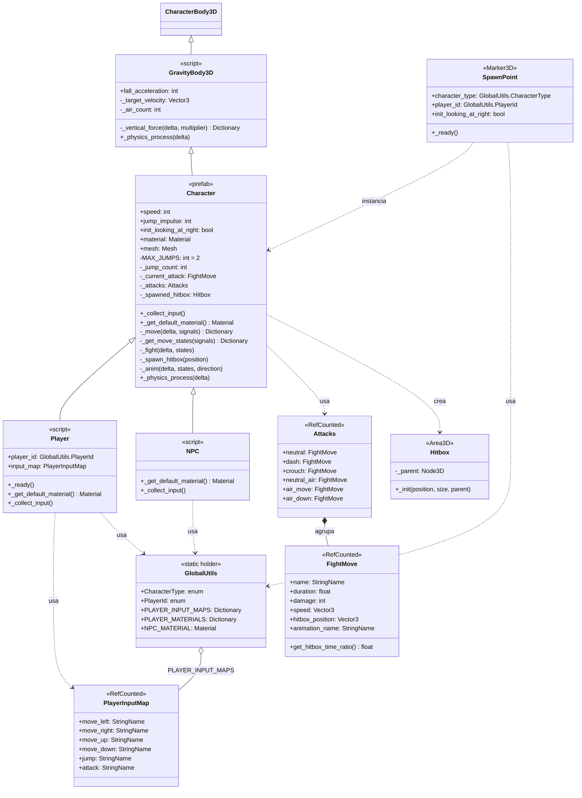

# UML — Arquitectura de código

> Mapa completo de las clases del proyecto: jerarquía de personajes, física, input, ataques y hitboxes.

## Diagrama de clases

## Notas

- **Jerarquía de física** — `Character` no hereda directo de `CharacterBody3D`, sino de `GravityBody3D` (`scripts/gravity_body_3d.gd`), que solo aporta gravedad (`_vertical_force`). Velocidad, salto y `move_and_slide()` siguen siendo de `Character`.
- **Pipeline `_physics_process`** (definido en `Character`, no en `GravityBody3D`) — `_collect_input()` (lo llena cada hijo) → `_vertical_force()` (gravedad, heredado) → `_move()` (velocidad + salto) → `_get_move_states()` (estados: moving, jumping, running, neutral_air, etc.) → `_fight()` (si hay ataque en curso, sobrescribe estados y velocidad, y dispara el hitbox) → `_anim()` (animación + rotación de malla).
- **Doble salto** — `MAX_JUMPS = 2`, contador vive en `Character` (no en `GravityBody3D`). `_jump_count` resetea en piso. Saltar habiendo caído sin saltar (`_air_count > 0`) consume el contador entero de golpe, para no regalar un salto extra.
- **Input por subclase, no genérico** — `Character` solo expone variables privadas (`_move_left`, `_attack`, etc.); cada hijo las llena directo en `_collect_input()`.
- **Player** (`scripts/player.gd`) — Declara `@export var player_id: GlobalUtils.PlayerId` y en su `_ready()` (tras llamar `super()`) resuelve `input_map` desde la tabla estática `GlobalUtils.PLAYER_INPUT_MAPS`. También sobrescribe `_get_default_material()` para tomar su color según ID.
- **NPC** (`scripts/npc.gd`) — clase se llama `NPC` (no `Npc`). Sin IA todavía: `_collect_input()` alterna `_jump` cada frame (placeholder, salta solo — el toggle es necesario porque el salto en `Character` dispara por flanco, no por valor sostenido). Sobrescribe `_get_default_material()` con `GlobalUtils.NPC_MATERIAL`.
- **`_get_default_material()`** — virtual nuevo en `Character`, devuelve `null` por defecto. Player y NPC lo sobrescriben según su tipo. En `_ready()` de `Character` solo se usa si el `@export var material` quedó vacío: el material puesto a mano en el editor siempre gana.
- **SpawnPoint** (`scripts/spawn_point.gd`) — solo decide **qué** personaje generar (`character_type`, `player_id`) y **dónde** (`global_position`, `init_looking_at_right`). Instancia `character.tscn`, le asigna el script (`Player` o `NPC`) y, si es jugador, su `player_id`.
- **GlobalUtils** (`scripts/helpers/global_utils.gd`) — Contiene `enum PlayerId`, `enum CharacterType`, la tabla estática `PLAYER_INPUT_MAPS` (una instancia de `PlayerInputMap` por jugador, creada una sola vez), `PLAYER_MATERIALS` y `NPC_MATERIAL`.
- **PlayerInputMap** (`scripts/helpers/player_input_map.gd`) — `RefCounted` que agrupa los 6 `StringName` de acciones del Input Map de un jugador (`move_left`, `move_right`, `move_up`, `move_down`, `jump`, `attack`). Evita hardcodear los nombres de acción dentro de `Player`.
- **Hitbox** — `Character._spawn_hitbox()` crea un `Hitbox` (`scripts/hitbox.gd`, construido 100% por código) como hijo de `$Pivot`.
- **Attacks / FightMove** (`scripts/helpers/attacks.gd`, `scripts/helpers/fight_move.gd`) — `Attacks` es el catálogo de movimientos disponibles (`neutral`, `dash`, `crouch`, `neutral_air`, `air_move`, `air_down`), cada uno una instancia de `FightMove` con su duración, daño, velocidad, posición de hitbox y animación. `Character._fight()` elige cuál activar según el estado de movimiento.
