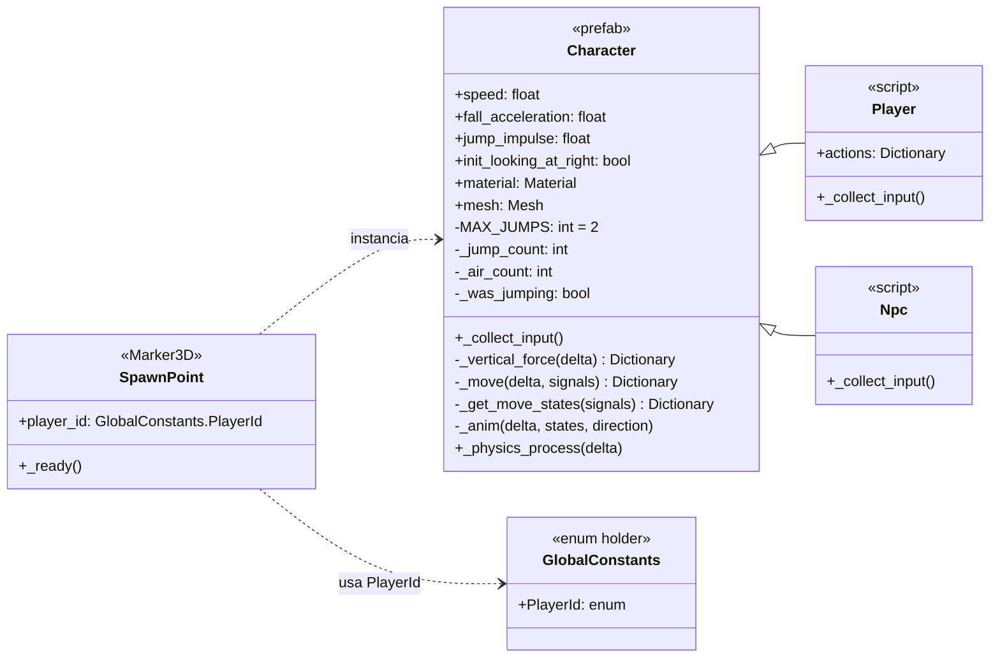

# UML — Arquitectura de Character

## Diagrama de clases

## Notas

- **Character** (`prefabs/character.tscn`, `scripts/character.gd`) — base `CharacterBody3D`: gravedad, doble salto, movimiento y animación. Player/Npc no tocan física, solo alimentan input.
- **Pipeline `_physics_process`** — `_collect_input()` (lo llena cada hijo) → `_vertical_force()` (gravedad) → `_move()` (velocidad + salto) → `_get_move_states()` (estados: moving, jumping, falling, etc.) → `_anim()` (rotación de malla + animación "run").
- **Doble salto** — `MAX_JUMPS = 2`. `_jump_count` resetea en piso. Salto iniciado en aire consume el contador entero de golpe (evita triple salto).
- **Input por subclase, no genérico** — Character solo expone variables privadas (`_move_left`, etc.); cada hijo las llena directo en `_collect_input()`. No hay resolución por string en Character.
- **Player** (`scripts/player.gd`) — `@export var actions: Dictionary` mapea acciones al Input Map. Si algún valor queda vacío, no hace nada (nodo sin configurar no truena). Cada instancia puede tener su propio set (teclado 1, teclado 2, gamepad).
- **Npc** (`scripts/npc.gd`) — sin IA todavía. `_collect_input()` alterna `_jump` cada frame (placeholder, salta solo). Toggle necesario porque el salto en Character dispara por flanco, no por valor sostenido.
- **SpawnPoint** (`scripts/spawn_point.gd`) — instancia `character.tscn` en `_ready()`, asigna `player_id`, orienta según `PLAYER_1`/`PLAYER_2`, posiciona y agrega vía `add_child.call_deferred`.
- **GlobalConstants** — solo `enum PlayerId { PLAYER_1, PLAYER_2 }`, evita hardcodear IDs.
- **Ojo** — `SpawnPoint` asigna `character.player_id`, pero `character.gd` no declara esa propiedad. Confirmar si es `@export` del `.tscn` o bug antes de depender de ella.
