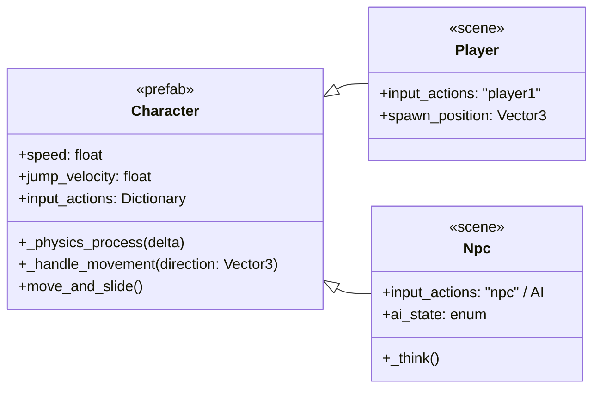

# UML — Arquitectura de Character

## Diagrama de clases

## Notas

- **Character** (`prefabs/character.tscn`) — Escena base reutilizable. Todo personaje (player o npc) hereda de aquí: física, gravedad, salto, colisión y esqueleto de input.
- **Player** — Hereda de Character. Usa acciones de input del `Input Map` (p. ej. `player1_left`, `player1_jump`). Puede haber varios players, cada uno con su propio set de acciones.
- **Npc** — Hereda de Character. **NO debe hardcodear el input del jugador**: debe estar listo para recibir inputs alternativos (otro gamepad, otro teclado, o IA). El sistema de input de Character debe ser configurable vía `@export input_actions`.
- El input del Character se resuelve por **nombre de acción configurable**, no hardcodeado, para que Player y Npc compartan la misma lógica de movimiento.
