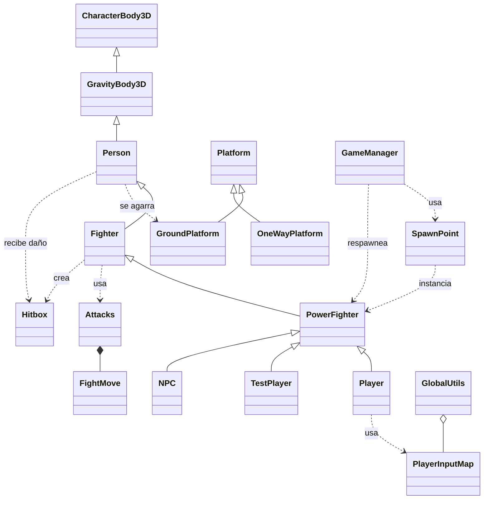

# UML — Arquitectura de código

> Mapa de clases del proyecto. Para la explicación de personajes ver `docs/arquitectura-personajes.md`.

## Personajes

```
CharacterBody3D → GravityBody3D → Person → Fighter → PowerFighter → Player / TestPlayer / NPC
```

## Diagrama



## Notas

- `GravityBody3D`: gravedad 2D + colisiones (normales y one-way).
- `Person`: moverse, saltar, ledge grab, daño, `respawn()`.
- `Fighter`: ataques (13 `FightMove`), grab y shield (temporizadores).
- `PowerFighter`: doble salto; poderes pendientes.
- `Character` y `OldFightMove` son legacy, fuera de la cadena.
- Señales-objeto: `VerticalForceSignals`, `MoveSignals`, `MoveStates` (RefCounted en `scripts/helpers`).
