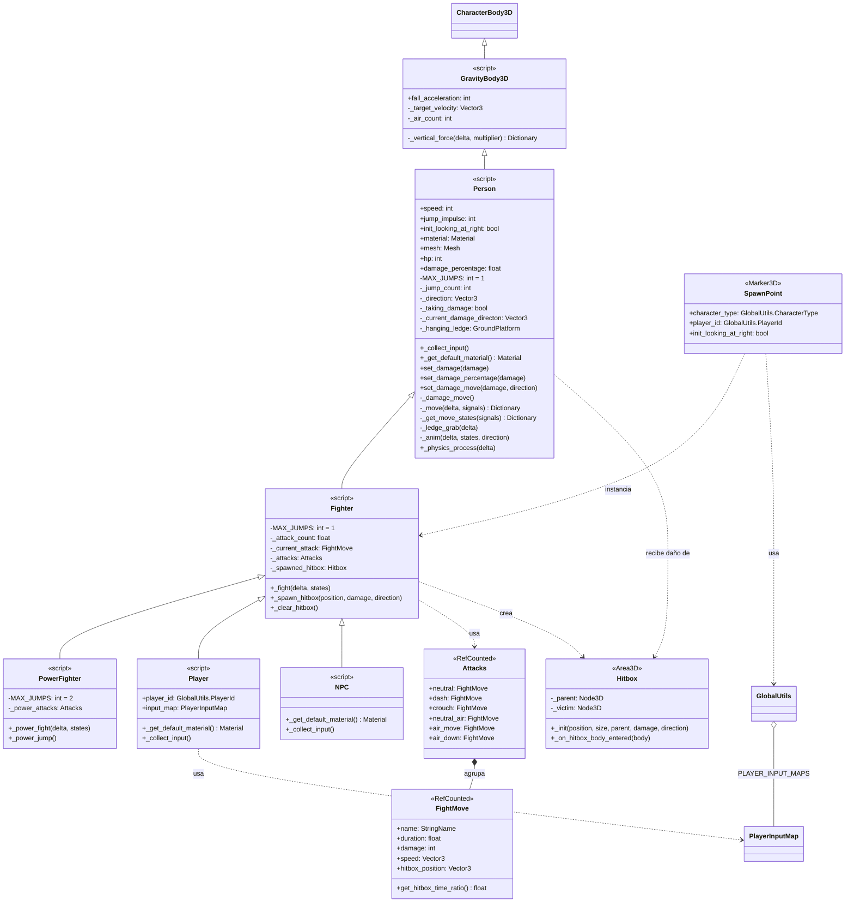

# UML — Refactor de Character (Person / Fighter / PowerFighter)

> Estado **propuesto** (no aplicado). Divide a `Character` en tres capas: `Person` (moverse y recibir daño), `Fighter` (dar trancazos) y `PowerFighter` (golpes con poder + doble salto). El diagrama actual del proyecto vive en `docs/uml-arquitectura.md`; este es el diagrama objetivo.

- `Person`: Papa de todos. Hijo de `GrevityBody3D`. Tendra métodos, y propiedades para moverse; Saltar, Correr, Caminar, y posiblemente agarrarse a bordos. Sera compatible con multiples saltos, pero por defecto solo salto una sola vez. También tandra propiedades y métodos necesarios para recibir golpes, stuneos por daño.

- `Fighter`: Hijo de Person. Tendra los métodos y propiedades necesarias para poder dar trancazos, y protegerse de estos. Por defecto puede saltar una vez.

- `PowerFighter`: Hijo de Fighter. Tendra métodos y propiedades necesarias para dar golpes con poder, posiblemente usara métodos de Fighter ya hechos. Por defecto saltara dos veces, y ademas tendra un salto de poder.

**Eso si, las señales ahora seran objetos, para evitar abstracción. Se podrian poner en `scripts/helpers`**

## Jerarquía propuesta

```
CharacterBody3D → GravityBody3D → Person → Fighter → PowerFighter
```

`Player` y `NPC` pasan a ser hijos de `Fighter` (o `PowerFighter` si se quiere conservar el doble salto — ver Decisiones pendientes).

## Diagrama de clases



## Responsabilidades por clase

- **`Person`** — el papá de todos los personajes. Hijo de `GravityBody3D`.
  - **Moverse**: correr, caminar, saltar (con `MAX_JUMPS` sobrescribible, default **1**), y posiblemente agarrarse a bordos (`_ledge_grab`).
  - **Recibir daño**: `hp`, `damage_percentage`, `set_damage*`, `_damage_move` y stun por daño (`_taking_damage`).
  - El pipeline `_physics_process` vive aquí (mover + recibir daño); `_collect_input()` es virtual y lo llenan los hijos.
- **`Fighter`** — hijo de `Person`. Puede dar trancazos y protegerse de estos.
  - **Dar daño**: `_attacks` (catálogo `Attacks`), `_fight()`, `_spawn_hitbox()`, `_clear_hitbox()`, ciclo de vida del hitbox.
  - **Protegerse**: placeholder (bloqueo/escudo futuro).
  - Salto default **1**.
- **`PowerFighter`** — hijo de `Fighter`. Golpes con poder reusando métodos de `Fighter`, y salto de poder. Salto default **2**.
  - `_power_attacks` (catálogo propio) y `_power_fight()` o extensión de `_fight()`.
  - `_power_jump()`: mecánica nueva, sin definir.

## ¿Dónde queda el código actual de `Character`?

| Pieza actual | Va a |
|---|---|
| `speed`, `jump_impulse`, `init_looking_at_right`, `material`, `mesh` | `Person` |
| `_move()`, `_get_move_direction()`, `_set_x_not_zero_value()`, `_direction`, `_x_not_zero_value`, `_jump_count`, `_was_jumping`, `_fall_acceleration_multiplier` | `Person` |
| `_get_move_states()` | `Person` (los estados los usan movimiento y ataque) |
| `_anim()` + `_get_attack_animation()` | `Person` base; `Fighter` sobrescribe las de ataque |
| `hp`, `damage_percentage`, `set_damage*`, `_damage_move()`, `_taking_damage`, `_current_damage_directon`, `_normal_damage_move_power` | `Person` |
| `_ledge_grab()` + vars y constantes `LEDGE_*`, `_hanging_ledge`, `_hang_position`, `_ledge_release_count` | `Person` |
| `_attack_count`, `_current_attack`, `_attacks`, `_attack_direction`, `_hitbox_count`, `_hitbox_duration`, `_spawned_hitbox`, `_fight()`, `_spawn_hitbox()`, `_clear_hitbox()` | `Fighter` |
| Física de one-way + medidas de pies/cabeza/media altura | `GravityBody3D` (propuesta abierta, ver `docs/nota-plataformas-character.md`) |
| `MAX_JUMPS` (hoy 2) | `Person` default 1 / `Fighter` 1 / `PowerFighter` 2 |

## Decisiones pendientes

1. **Conteo de saltos**: hoy todos saltan 2 veces (`MAX_JUMPS = 2`). Con la propuesta `Fighter` salta 1. Para conservar el doble salto, `Player`/`NPC` actuales deberían extender `PowerFighter` (o `Fighter` define `MAX_JUMPS = 2`). Confirmar intención.
2. **Nombre `Person`**: reemplaza a `class_name Character`. Impacta `hitbox.gd` (`body is Character` → `body is Person`), `character.tscn`, `spawn_point.gd`, docs y UML. Alternativa: conservar `Character` como nombre del papá.
3. **Hitbox**: el check de víctima pasa de "es un Character" a "es un Person" (cualquier personaje que pueda recibir daño, no solo luchadores).
4. **Animación**: decidir si `_anim` se parte (movimiento en `Person`, ataque en `Fighter`) o se virtualiza con `_get_attack_animation()`. Encaja con la propuesta previa de quitar `animation_name` de `FightMove`.
5. **PowerFighter**: el "salto de poder" y "golpes con poder" no están definidos. Sugerencia: implementar `Person` + `Fighter` ya (es reacomodo de código existente) y dejar `PowerFighter` como stub o clase con `_power_attacks` extra, sin inventar mecánicas todavía.
6. **Coordinación con plataformas**: no mover lo mismo dos veces — la física de one-way/medidas va a `GravityBody3D`; el agarre de orillas (movimiento) va a `Person`. Al reestructurar, de paso se arregla el orden de `_ledge_grab` vs `_fight`/`_anim` (ver `docs/nota-plataformas-character.md`).
7. **`GlobalUtils.CharacterType`**: valorar si gana un tercer tipo (`POWER_FIGHTER`) o si `character_type` solo decide entre `Player`/`NPC` como hoy.
